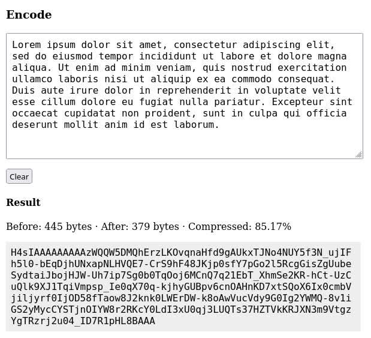

# Base64 Compressor

> Compress and encode data as URL-safe base64 string



## Why

It can be useful to encode data, such as application state or binary file, into a string that is compressed and safe to use in URL query string or hash, as well as in JSON.

## How

For `gzip` compression and decompression, it uses the [Compression Streams API](https://developer.mozilla.org/en-US/docs/Web/API/Compression_Streams_API), well-supported by browsers and on server side.

Binary to text encoding is done according to the specification for [Base 64 Encoding with URL and Filename Safe Alphabet](https://datatracker.ietf.org/doc/html/rfc4648#section-5).

## Install

```sh
npm install --save base64-compressor
```

## Usage

Encode/decode JSON-serializable JavaScript value

```ts
import { encode, decode } from 'base64-compressor'

const object = {
  key: 'value'
}

const base64string = await encode(object)
const decoded =  await decode(base64string)

assert.deepEqual(decoded, object)
```

Encode/decode binary (array buffer)

```ts
import { encodeBinary, decodeBinary } from 'base64-compressor'

const buffer = new ArrayBuffer(8)

const base64string = await encodeBinary(buffer)
const decoded =  await decodeBinary(base64string)

assert.deepEqual(decoded, buffer)
```
